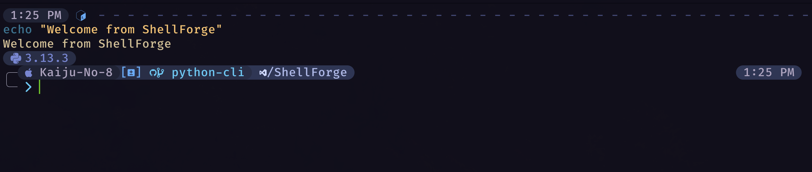

<p align="center">
  
</p>

---

<p align="center">
  <a href="https://github.com/alanoj/ShellForge/stargazers"></a>
  <a href="https://github.com/alanoj/ShellForge/releases"></a>
  <a href="https://github.com/alanoj/ShellForge/blob/main/LICENSE"></a>
</p>

**ShellForge** is a reproducible terminal environment bootstrap tool designed to recreate a complete development CLI environment on any machine.

It installs system tools, deploys shell configuration, and sets up editor environments using a single command — making developer environments portable and reproducible.

ShellForge demonstrates DevOps‑style environment automation through:

- CLI tooling
- environment bootstrapping
- configuration management
- reproducible development environments

---

# 🚀 Demo

## Install Demo


The installer provides a live terminal UI with:

- animated progress bar
- live streaming logs
- dependency detection
- configuration deployment

## Post‑Install Terminal Prompt

After the bootstrap completes, the configured shell prompt and environment are ready to use.



This screenshot should show the final Oh‑My‑Posh prompt with Git status indicators and the configured terminal environment.

---

# 🏰 What is ShellForge?

ShellForge allows developers to instantly recreate their development environment on any machine.

With one command you can install tools, deploy configs, and configure your shell exactly the same every time.

Typical use cases:

- onboarding new machines
- portable developer environments
- reproducible workstation setup
- CLI environment management

---

# 🧱 Architecture Overview

Below is the high‑level structure of the ShellForge environment.

```
                    ┌─────────────────────┐
                    │     Brewfile        │
                    │ (System Packages)   │
                    └─────────┬───────────┘
                              │
                              ▼
                  ┌─────────────────────┐
                  │     Shell Layer     │
                  │   (.zshrc, aliases) │
                  └─────────┬───────────┘
                            │
        ┌───────────────────┼───────────────────┐
        ▼                   ▼                   ▼
┌──────────────┐   ┌────────────────┐   ┌────────────────┐
│ Oh My Posh   │   │   Plugins      │   │    Neovim      │
│ Theme        │   │ (fzf, autosug) │   │ Lua Config     │
└──────────────┘   └────────────────┘   └────────────────┘
        │                                       │
        ▼                                       ▼
   Git Status Glyphs                      LSP / Plugins
   Branch Tracking                         Treesitter
```

---

# 🛠 Components of the Forge

## ⚔️ Prompt (Oh My Posh)

Custom prompt providing:

- Git branch tracking
- Ahead / behind indicators
- Stash detection
- Execution timing
- Exit status indicators

Location:

```
shellforge.omp.json
```

---

## 🧙 Shell Layer (Zsh)

Provides core shell configuration including:

- aliases
- environment variables
- plugin sourcing
- PATH management

Files:

```
shell/.zshrc
shell/aliases.zsh
```

---

## 🔮 Neovim Configuration

Modern Lua‑based Neovim configuration.

```
nvim/
├── init.lua
└── lua/
    ├── plugins/
    ├── lsp/
    ├── ui/
    └── core/
```

Includes:

- plugin manager
- LSP configuration
- syntax highlighting
- fuzzy finding
- git integration

---

## 🧰 System Tooling

Installed through Homebrew and tracked via:

```
Brewfile
```

Typical tools:

- neovim
- fzf
- ripgrep
- git
- oh‑my‑posh

---

# 📦 Installation

## 1. Clone Repository

```bash
git clone https://github.com/alanoj/ShellForge.git
cd ShellForge
```

## 2. Install Packages

```bash
brew bundle install
```

## 3. Deploy Prompt Theme

```bash
mkdir -p ~/.config/oh-my-posh/themes
cp shellforge.omp.json ~/.config/oh-my-posh/themes/
```

Add to `.zshrc`

```bash
eval "$(oh-my-posh init zsh --config ~/.config/oh-my-posh/themes/shellforge.omp.json)"
```

## 4. Install Neovim Config

```bash
mkdir -p ~/.config/nvim
cp -R nvim/* ~/.config/nvim/
```

## 5. Reload Shell

```bash
exec zsh
```

---

# 🧪 Continuous Integration

ShellForge uses GitHub Actions to validate builds and CLI functionality.

CI performs:

- dependency installation
- lint checks
- static type checks
- CLI smoke tests

Workflow location:

```
.github/workflows/ci.yml
```

---

# 📁 Repository Structure

```
ShellForge/
├── README.md
├── Brewfile
├── shellforge.omp.json
├── shell/
├── nvim/
├── scripts/
├── docs/
│   └── assets/
└── .github/
    └── workflows/
```

Media files used in this README should be placed in:

```
docs/assets/
```

Example assets:

- `shellforge-banner.png`
- `install-demo.gif`
- `progress-ui.png`
- `architecture-diagram.png`
- `prompt-after-install.png`

---

# 🧠 Philosophy

ShellForge follows DevOps‑style development principles.

- Portable environments
- Version‑controlled configuration
- Reproducible system setup
- Automated developer onboarding

Instead of manually configuring machines, environments are defined as code.

---

# 📜 License

MIT License

Forge your own developer loadout.
